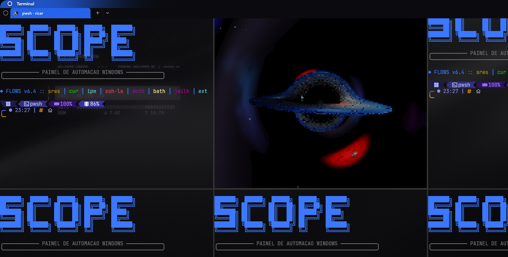

# black_hole — GPU fork (Kerr · wallpaper · terminal)

Real-time black hole simulation via **geodesic ray-marching** in a **compute shader**
(OpenGL 4.3). A fork of [`kavan010/black_hole`](https://github.com/kavan010/black_hole)
with extended physics (Kerr), cinematic post-processing, and three new ways to run it —
including as a **live Windows wallpaper** and **inside the terminal**.

<p align="center">
  
</p>

<p align="center"><sub>Rendered headless with <code>--render --spin 0.9 --tilt 18 --anim --blue --zoom 4.5e11</code></sub></p>

> **This is a fork.**
> Original upstream: **[kavan010/black_hole](https://github.com/kavan010/black_hole)** —
> credit to the author for the base (ray-tracing, accretion disk, spacetime grid).
> Fork: **[devAndreotti/black_hole](https://github.com/devAndreotti/black_hole)**.
>
> <a href="https://devandreotti.github.io/black_hole/">🌐 devandreotti.github.io/black_hole</a>

---

## Acknowledgement

When I first saw the original video showcasing this project, it immediately stuck with me. I saved it and kept thinking about it for weeks — perhaps even a month or two after it was released. There was something fascinating about seeing a black hole simulated in real time, and I remember telling myself that one day I wanted to modify it and find a way to actually use it somewhere.

This fork is the result of that idea.

The original project was inspiring enough that I kept coming back to it long after I first discovered it. Eventually, curiosity turned into experimentation, and experimentation turned into new features: Kerr black holes, cinematic rendering, wallpaper integration, terminal rendering, and more.

**All credit for the original project belongs to its creator.** The foundation, rendering techniques, and original vision came from the upstream repository. This fork is simply my attempt to build upon an already incredible piece of work and explore where those ideas could go next.

Thank you for creating something inspiring enough to revisit months later.

---

## What this fork adds (differences vs. upstream)

### Physics

* **Kerr (rotating) black hole** — Cartesian Kerr-Schild integrator with *no axis seam*,
  showing frame-dragging (a "D"-shaped shadow, an offset photon ring). Toggle with `K` or
  `--spin a*`. With no spin it falls back to the Schwarzschild integrator, identical to
  upstream.
* **Axis tilt** (`--tilt G°` / key `T`) — disk + spin axis + jets all tip together to any
  angle; the Kerr effect follows.
* **Variable ISCO** — the disk's inner edge recedes as the spin rises.
* **Relativistic Doppler beaming + gravitational redshift** on the disk.

### Appearance / living scene
- **Relativistic polar jets** (Blandford-Znajek) — appear with spin; color follows the palette.
- **Color palette** cyclable with `F` or via flag: `--red` / `--white` / `--blue` /
  `--green` — disk, jets, and meteors all follow the same palette.
- **3D suns with life**: coronae, limb-darkening, granulation and starspots; a variable sun
  that flares; **orbiting moons** and a **binary companion** (animate with `A`).
- **Meteors**: transit (a flyby that grows in from afar) or **capture with
  spaghettification** + redshift, tapering until it vanishes at the horizon.
- **Deep sky**: starfield, dust, a lensed spiral galaxy (Einstein ring) and distant suns.

### Post-processing / camera
- **ACES tone mapping** (filmic) on the final frame + **TAA** (temporal anti-aliasing) + **bloom**.
- **Cinematic mode** (`--cinematic` / key `C`) — the camera flies a looping path
  (far/face-on → an edge-on dive into the photon ring → recede).

### Platform / ways to run (Windows)
- **Wallpaper mode** — renders *behind the desktop icons* via DirectComposition
  (Win11 24H2). Runs in the background with mouse parallax.
- **Terminal mode** — renders *inside the terminal* using truecolor ANSI half-blocks
  (the same GPU pipeline), with frame-diffing and a resolution cap so it never stalls.
- **Portable toolchain** — `setup.ps1` downloads MinGW-w64, cmake, ninja, and the GL
  libraries into `.deps` (one-time, ~300 MB); **no vcpkg**, no admin, nothing system-wide.
- **Headless render** (`--render`) — saves a high-res BMP for visual validation.

---

## Requirements

- **Windows 10/11** (64-bit) — wallpaper mode requires Win 11 24H2+
- **GPU with OpenGL 4.3** — any NVIDIA GTX 600+, AMD Radeon HD 7000+, or Intel HD 4000+
  (roughly 2012 or later); driver must be up to date

## Install

Run once to download the portable toolchain (~300 MB total):

```powershell
.\setup.ps1
```

This fetches MinGW-w64 (compiler + cmake + ninja) and the OpenGL libraries (GLEW, GLFW3,
GLM) into `.deps\`. Nothing is installed system-wide. Re-running is safe — it skips
anything already cached.

## Build

```powershell
.\build.ps1
```

Produces `build\winlibs\BlackHole3D.exe` (GPU) and `BlackHole2D.exe` (2D lens).
Re-run after any code change; the build script kills a running instance automatically.

## Run

```powershell
.\run.ps1                 # interactive window (default)
.\run.ps1 --terminal      # inside the terminal (truecolor ANSI)
.\run.ps1 --wallpaper     # live wallpaper (quit: Ctrl+Alt+Q)
.\run.ps1 --2d            # 2D gravitational lens
.\run.ps1 stop            # kill the processes
```

### Wallpaper mode
Renders behind the icons (DirectComposition). Mouse = parallax; **Ctrl+Alt+Q** quits from
anywhere. Tune quality with `BH_WP_DIV` (`1` = native, `2` = default, `3`–`4` = lighter).

### Terminal mode
The same GPU pipeline drawn into text cells (`▀`, truecolor): full-screen, opaque. It
rewrites only the cells that changed (frame-diff) and caps the ray-march resolution
(`BH_TERM_MAXRES`, default `220x160`) so it won't stall when the font is small.

## Flags and controls

Full reference (every flag, keys per mode, environment variables) in **[RUNNING.md](RUNNING.md)**.
Summary:

| Flag | Effect |
|---|---|
| `--spin a*` | Kerr spin 0–1 (1 = extremal) |
| `--tilt G` | Tilt the BH axis by G degrees |
| `--anim` | Keplerian disk spinning + orbiting moons |
| `--cinematic` | Camera flies a looping path |
| `--red` / `--white` / `--blue` / `--green` | Disk/jet/meteor palette |
| `--render` | One headless frame → BMP (`--size`, `--time`, `--out`, …) |
| `--legacy` | Original Schwarzschild shader (for comparison) |

Key controls (work in window/terminal/wallpaper): `K` spin · `.`/`,` fine spin ·
`T`/Shift+`T` tilt · `A` animation · `F` palette · `C` cinematic · `B` bloom · `M` grid ·
`+`/`-` zoom · arrows orbit.

---

## How the code works

- **2D** (`BlackHole2D`): direct gravitational lensing in `2D_lensing.cpp`.
- **3D** (`BlackHole3D`): `black_hole.cpp` builds the scene and UBOs (camera, disk,
  objects) and dispatches the `geodesic.comp` compute shader, which integrates the
  geodesics on the GPU. The `bh_engine` (GL pipeline / bloom / TAA), `bh_terminal` and
  `bh_wallpaper` modules handle each output mode. See [RUNNING.md](RUNNING.md) for the
  Kerr × legacy detail and the architecture.

## Credits

- **Original base:** [kavan010/black_hole](https://github.com/kavan010/black_hole) —
  ray-tracing, accretion disk, and spacetime grid.
- **Fork and extensions** (tiltable Kerr, jets, wallpaper, terminal, cinematic, ACES,
  living scene): this repository.

License follows the upstream project.
